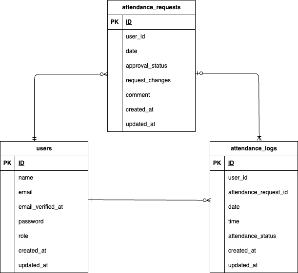

# attendance-management-system
## 環境構築
### Dockerビルド
1. git clone git@github.com:saaya0401/attendance-management-system.git
1. docker-compose up -d --build

### Laravel環境構築
1. docker-compose exec php bash
1. composer install
1. cp .env.example .env
1. .envファイルの一部を以下のように編集
```
APP_TIMEZONE=Asia/Tokyo

APP_LOCALE=ja

DB_CONNECTION=mysql
DB_HOST=mysql
DB_DATABASE=laravel_db
DB_USERNAME=laravel_user
DB_PASSWORD=laravel_pass

QUEUE_CONNECTION=sync

MAIL_MAILER=smtp
MAIL_HOST=mailhog
MAIL_PORT=1025
MAIL_FROM_ADDRESS="attendance-management-system@example.com"
```

5. php artisan config:clear
1. php artisan key:generate
1. php artisan migrate
1. php artisan db:seed
1. php artisan config:cache

## 一般ユーザーのログイン用初期データ
- メールアドレス: saaya@example.com
- パスワード: saayakoba


## 管理者ユーザーのログイン用初期データ
- メールアドレス： admin@example.com
- パスワード： adminadmin


## テスト手順
1. テスト用データベースの作成
```
1. docker-compose exec mysql bash
2. mysql -u root -p
3. password入力を求められたらrootと入力する
4. CREATE DATABASE demo_test;
```
2. docker-compose exec php bash
1. cp .env .env.testing
1. .env.testingの一部を以下のように編集
```
APP_ENV=test
APP_KEY=

DB_DATABASE=demo_test
DB_USERNAME=root
DB_PASSWORD=root
```
5. php artisan key:generate --env=testing
1. php artisan config:cache
1. php artisan config:clear
1. php artisan migrate --env=testing

*php artisan test でまとめてテストするとエラーになることがあるので個別にテストしてください

5. php artisan test --filter RegisterTest
1. php artisan test --filter LoginTest
1. php artisan test --filter LogoutTest


## 使用技術
- MySQL 8.0.26
- PHP 8.2-fpm
- Laravel 11.44.2

## URL
- 環境開発
  1. 一般ユーザーのサイト: http://localhost/login
  1. 管理者ユーザーのサイト: http://localhost/admin/login

- phpMyAdmin: http://localhost:8080/
- MailHog: http://localhost:8025

## ER図

